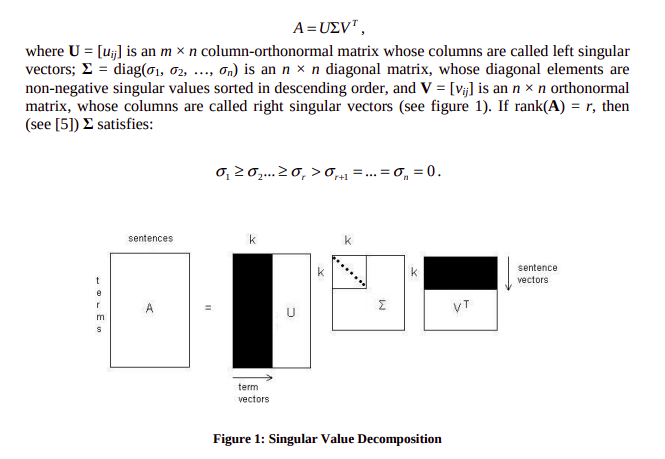
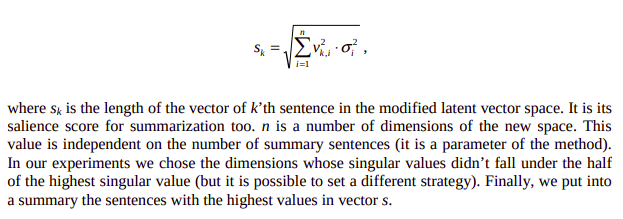
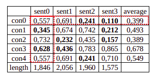

# document_summarization

### André Weber e Matheus Pellizzon  

<br>
Para este projeto implementamos um sumarizador de documentos. Dessa forma através de dois métodos escolhidos, selecionamos as frases que mais representavam um texto dado.  
Para a sumarização utilizamos a técnica LSA para a análise semântica e identificação de relações entre documentos e termos, produzindo um conjunto de conceitos relacionados à essas relações.  

---

## Técnicas utilizadas
### Passo 1
Através do texto de entrada criamos uma matriz em que as colunas são as sentenças e as linhas são as palavras/frases. As células são utilizadas para representar a importância de cada palavra para a sentença. As células são preenchidas de acordo com a frequência da palavra na sentença.

### Passo 2
Utilizamos um método chamado SVD (Singular Value Decomposition) que modela as relações entre palavras e sentenças da matriz de entrada, que em seguida gera três outras matrizes.


_Fonte: Steinberger J, Jezek K. Using Latent Semantic Analysis in text summarization and summary evaluation. In: Proceedings of ISIM ‘04 2004: 93–100._

### Passo 3
Em seguida decidimos o método de seleção para capturar as sentenças mais importantes de acordo com o SVD gerado.

**Steinberger and Jezek**  
Este algoritmo utiliza o tamanho de cada vetor de sentença da matriz V de conceitos e sentenças. O tamanho da sentença é calculado através dos indíces dos conceitos cujos valores são iguais ou menores à dimensão dada. Dessa forma, a que obtiver o maior valor será escolhida para representar o sumário.
```
No cálculo da pontuação das sentenças, o número de conceitos pode ser dado pelo usuário, caso não seja, todos os conceitos extraídos são utilizados
``` 


_Fonte: Steinberger J, Jezek K. Using Latent Semantic Analysis in text summarization and summary evaluation. In: Proceedings of ISIM ‘04 2004: 93–100._

**Cross Method**  
Este outro algoritmo é considerado uma extensão da abordagem de Steinberger and Jezek. Entre o cálculo do SVD e a seleção é elaborado um pré-processamento que remove efeitos de sentenças não principais sobre os conceitos relacionados. Em seguida é calculada a média dos pontos das sentenças para cada conceito. Os valores das células menor ou igual à média são dados como zero.  
Posteriormente é feito os passos do método Steinberger and Jezek com uma modificação: não é feita a multiplicação de V pelos valores de Σ. Então as sentenças com maiores pontuações, calculadas pela soma dos valores dos conceitos, são escolhidas para representar o sumário. 
```
No cálculo da pontuação das sentenças, o número de conceitos pode ser dado pelo usuário, caso não seja, todos os conceitos extraídos são utilizados
``` 
  
_Fonte: Ozsoy MG, Cicekli I, Alpaslan FN. Text summarization of Turkish texts using Latent Semantic Analysis. In: Proceedings of
the 23rd international conference on computational linguistics (Coling 2010) 2010: 869–876._

## Algoritmo Python

### summarizer
O sumarizador se encontra no arquivo summarizer.py, ele contém os dois métodos utilizados e as etapas anteriores.

**Executando:**

```
python summarizer.py TextoDeEntrada métodoDesejado numeroDeFrases numeroDeConceitos
```

